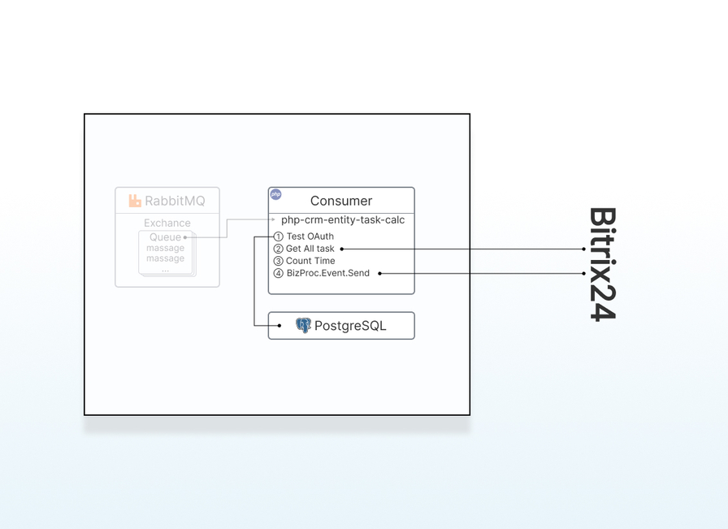

# @bitrix24/app-template-automation-rules

An application for creating robots (actions) for Bitrix24 business processes using RabbitMQ.

## Core Components
- **Consumers**:
  - `nodejs-pdf-from-html`: Generates PDF invoices from HTML using deal/lead data
  - `php-crm-entity-task-calc`: Calculates task durations for deals/leads
- **Required scopes**: `crm,catalog,bizproc,placement,user_brief,task,documentgenerator`

## 📁 Project Structure
```plaintext
/frontend
  /app          # Application pages (Nuxt3)
  /server       # API and event handlers
  /prisma       # Database models (PostgreSQL)
  /content      # Markdown action descriptions
  /i18n         # Localization
  /tools        # Translation scripts
/consumers
  /activities   # Action consumers
    /nodejs-pdf-from-html        # PDF generator
    /php-crm-entity-task-calc    # Task calculator
/chrome         # Chrome configuration for rendering
```

## 🐳 Docker Installation

- [Docker](https://docs.docker.com/compose/install/)
- [Docker Compose](https://docs.docker.com/compose/install/linux/)

```shell
# 1. Install Docker and Docker Compose
# 2. Create network
docker network create proxy-net

# 3. Launch core services
docker compose -f docker-compose.server.yml -p server__global up -d
```

### 🔧 Development (Dev)


Configure environment variables:
```shell
cp .env.dev.example .env.dev
```

```shell
# Start
docker compose -f docker-compose.dev.yml --env-file .env.dev -p dev__app-template-automation-rules up -d --build

# DB migration
docker exec -it dev-frontend sh -c "pnpm run prisma:migrate-deploy"

# Stop
docker compose -f docker-compose.dev.yml --env-file .env.dev -p dev__app-template-automation-rules down
```

**Container management:**
```shell
# Logs
docker logs -f dev-frontend
docker logs -f dev__app-template-automation-rules-consumer-nodejs-pdf-from-html-1
docker logs -f dev__app-template-automation-rules-consumer-php-crm-entity-task-calc-1
docker logs -f dev-db

# Consumer scaling
docker compose -f docker-compose.dev.yml --env-file .env.dev -p dev__app-template-automation-rules down consumer-php-crm-entity-task-calc && \
 docker compose -f docker-compose.dev.yml --env-file .env.dev -p dev__app-template-automation-rules up -d --build --scale consumer-php-crm-entity-task-calc=2
 
docker compose -f docker-compose.dev.yml --env-file .env.dev -p dev__app-template-automation-rules down consumer-nodejs-pdf-from-html && \
 docker compose -f docker-compose.dev.yml --env-file .env.dev -p dev__app-template-automation-rules up -d --build --scale consumer-nodejs-pdf-from-html=2

# Restart
docker compose -f docker-compose.dev.yml --env-file .env.dev -p dev__app-template-automation-rules down && \
 docker compose -f docker-compose.dev.yml --env-file .env.dev -p dev__app-template-automation-rules up -d --build
 
# Container debugging
docker exec -it dev-frontend sh
docker exec -it dev-frontend sh -c "ls .la"
docker exec -it dev__app-template-automation-rules-consumer-nodejs-pdf-from-html-1 sh
docker exec -it dev__app-template-automation-rules-consumer-php-crm-entity-task-calc-1 sh
# @memo dbuser && dbapp see in .env.xxx
docker exec -it dev-db psql -U dbuser -d dbapp
dbapp# select "memberId", "userId", "domain" from "B24App";
```

### 🚀 Production (Prod)


Configure environment variables:
```shell
cp .env.prod.example .env.prod
```

```shell
# Start
docker compose -f docker-compose.prod.yml --env-file .env.prod -p prod__app-template-automation-rules build
docker compose -f docker-compose.prod.yml --env-file .env.prod -p prod__app-template-automation-rules up -d

# DB migration
docker compose -f docker-compose.prod.yml --env-file .env.prod -p prod__app-template-automation-rules --profile migrate up migrator

# Stop
docker compose -f docker-compose.prod.yml --env-file .env.prod -p prod__app-template-automation-rules down
```

**Container management:**
```shell
# Logs
docker logs -f prod-frontend
docker logs -f prod__app-template-automation-rules-consumer-nodejs-pdf-from-html-1
docker logs -f prod__app-template-automation-rules-consumer-php-crm-entity-task-calc-1
docker logs -f prod-db

## Rebuild migration
docker compose -f docker-compose.prod.yml --env-file .env.prod -p prod__app-template-automation-rules --profile migrate down migrator && \
  docker compose -f docker-compose.prod.yml --env-file .env.prod -p prod__app-template-automation-rules --profile migrate up --build migrator

# Consumer scaling
docker compose -f docker-compose.prod.yml --env-file .env.prod -p prod__app-template-automation-rules down consumer-php-crm-entity-task-calc && \
 docker compose -f docker-compose.prod.yml --env-file .env.prod -p prod__app-template-automation-rules up -d --scale consumer-php-crm-entity-task-calc=2
 
docker compose -f docker-compose.prod.yml --env-file .env.prod -p prod__app-template-automation-rules down consumer-nodejs-pdf-from-html && \
 docker compose -f docker-compose.prod.yml --env-file .env.prod -p prod__app-template-automation-rules up -d --scale consumer-nodejs-pdf-from-html=2

# Container debugging
docker exec -it prod-frontend sh
docker exec -it prod__app-template-automation-rules-consumer-nodejs-pdf-from-html-1 sh
docker exec -it prod__app-template-automation-rules-consumer-php-crm-entity-task-calc-1 sh
# @memo dbuser && dbapp see in .env.xxx
docker exec -it prod-db psql -U dbuser -d dbapp
dbapp# select "memberId", "userId", "domain" from "B24App";
```

### 🔍 Monitoring
```shell
docker stats
docker ps
docker ps -a | grep chrome
watch -n 2 docker ps

sudo systemctl status docker
sudo ss -tuln | grep 2376

watch -n 5 "docker stats --no-stream --format 'table {{.Name}}\t{{.CPUPerc}}\t{{.MemUsage}}\t{{.MemPerc}}'"

docker compose -f docker-compose.dev.yml -p dev__app-template-automation-rules top
docker compose -f docker-compose.prod.yml -p prod__app-template-automation-rules top
```

### 🧹 Cleanup
```shell
# Delete all stopped containers
docker container prune

# Remove all unused images
docker image prune -a

# Delete unused volumes
docker volume prune

docker volume ls
docker volume rm xxx1 xxx2 xxx3

docker volume prune -a

# Delete EVERYTHING unused (including volumes and images)
docker system prune -a --volumes
```

## Application


Application pages in `frontend/app/pages`:
- `install.client.vue` - installation handler
- `index.client.vue` - main page redirects to `activity-list.client.vue`
- `activity-list.client.vue` - shows actions list and app settings
- `pages/setting/[code].client.vue` - `placement` handler for BP action parameters (requires customization)

Special page `render/invoice-by-entity/[entityTypeId]-[entityId].server.vue` generates invoices. Server-side only, used by `CrmEntityTaskCalc`.


Server scripts in `frontend/server`:
- `rabbitmq.config.ts` configures RabbitMQ connections

Event handlers:
- `api/event/onAppInstall.post.ts` - app installation (stores tokens in DB)
- `api/event/onAppUninstall.post.ts` - app removal (deletes tokens)

Business process action handlers:
- `api/activities/[code].post.ts` - receives calls, finds `memberId`, publishes to 'activities.v1' exchange [`producer`].

## Business Process Action (Robot)

Action settings in `frontend/app/activity.config.ts`. Descriptions in `frontend/content/activities/xx/yyyy.md`.

### Creating New Action
Example code: `NewDemoActivity`

Steps:
1. Configure in `frontend/app/activity.config.ts`:
```typescript
export const activitiesConfig: ActivityOrRobotConfig[] = [
  // ...
  {
    type: 'robot',
    CODE: 'NewDemoActivity',
    FILTER: { /*...*/ },
    PROPERTIES: { /*...*/ },
    RETURN_PROPERTIES: { /*...*/ }
  }
]
```
2. Add description: `frontend/content/activities/en/NewDemoActivity.md`
```markdown
---
title: Title for new activity
description: Description for new activity
categories: 
  - 'category_1'
  - 'category_2'
badges: 
  - 'badge_1'
  - 'badge_2'
avatar: '/activities/NewDemoActivity.webp'
---
```
3. Add icon: `frontend/public/activities/NewDemoActivity.webp`
4. Install action via Bitrix24
5. Create consumer in `consumers/activities/new-demo-activity` handling queue `activity.NewDemoActivity.v1`
6. Configure in `docker-compose.*.yml` files

### `PdfFromHtml` Example

- NodeJS-based (`consumers/activities/nodejs-pdf-from-html`)
- Main file: `app/consumer.ts` (`processMessage()` logic)
- Renders page: `frontend/app/pages/render/invoice-by-entity/[entityTypeId]-[entityId].server.vue`
- RabbitMQ config: `app.config.ts`

Workflow:
1. Gets auth data from message → verifies in DB
2. Creates JWT token (5min TTL) with oAuth params
3. Calls Chrome-rendered page `render/invoice-by-entity/[entityTypeId]-[entityId]`
4. Page script validates JWT → fetches deal/lead data from Bitrix24
5. Generates HTML invoice → converts to PDF via Chrome
6. Sends PDF to Bitrix24

### `CrmEntityTaskCalc` Example

- PHP-based (`consumers/activities/php-crm-entity-task-calc`)
- Main file: `consumer.php` (logic in `src/Processor.php`)
- RabbitMQ config: `src/ConfigRabbitMQ.php`

Workflow:
1. Fetches/renews auth from DB via `memberId`
2. Retrieves all entity tasks from Bitrix24 (admin rights)
3. Calculates task durations
4. Returns results to waiting Bitrix24 business process

## 🔌 RabbitMQ Architecture

> `v1` = version tag for routing organization

Implementation:
- **producer** → **exchange** `activities.v1`
- Service **exchange** `activities.service.v1`
- Dead-letter **queue** `activities.failed.v1`
- Per-action queues: `activity.activityCode.v1` + `activity.activityCode.delayed.6000.v1`
- Failure handling:
  - (1) Consumer crash → message requeued
  - (2) Success → message removed
  - (3) Processing failure:
    - First 4 attempts → `delayed.6000` (6sec) → retry
    - 5th attempt → `failed.v1` (manual handling required)

## 🛠 Development Tools
AI-powered translation via DeepSeek (scripts in `frontend/tools`):
```shell
# Translate action descriptions
pnpm run translate-content

# Translate UI phrases
pnpm run translate-ui
```

## 🔮 Roadmap
- [OpenTelemetry](https://opentelemetry.io/) integration
- Dead-letter queue (`activities.failed.v1`) processing system
- RabbitMQ optimizations for NodeJS/PHP
- Bitrix24 Market publication assets
